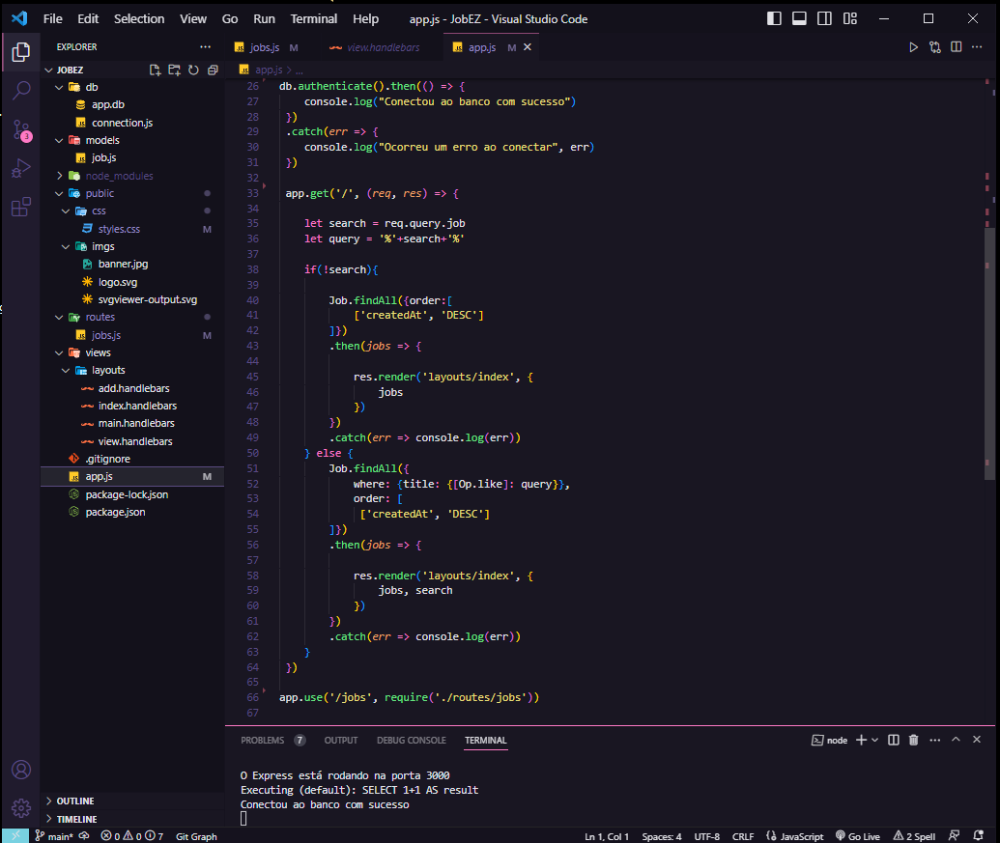
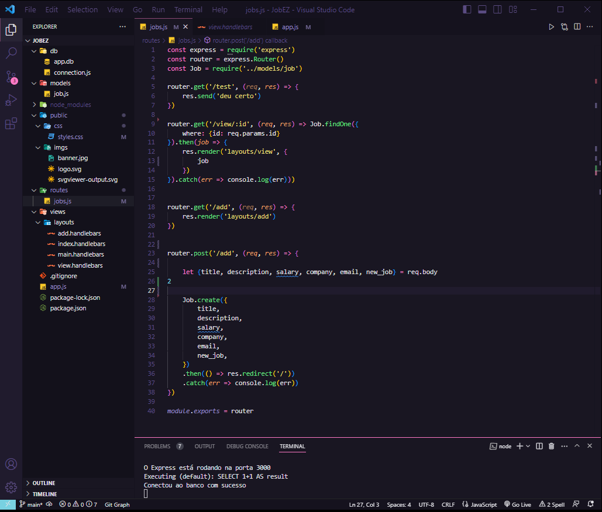
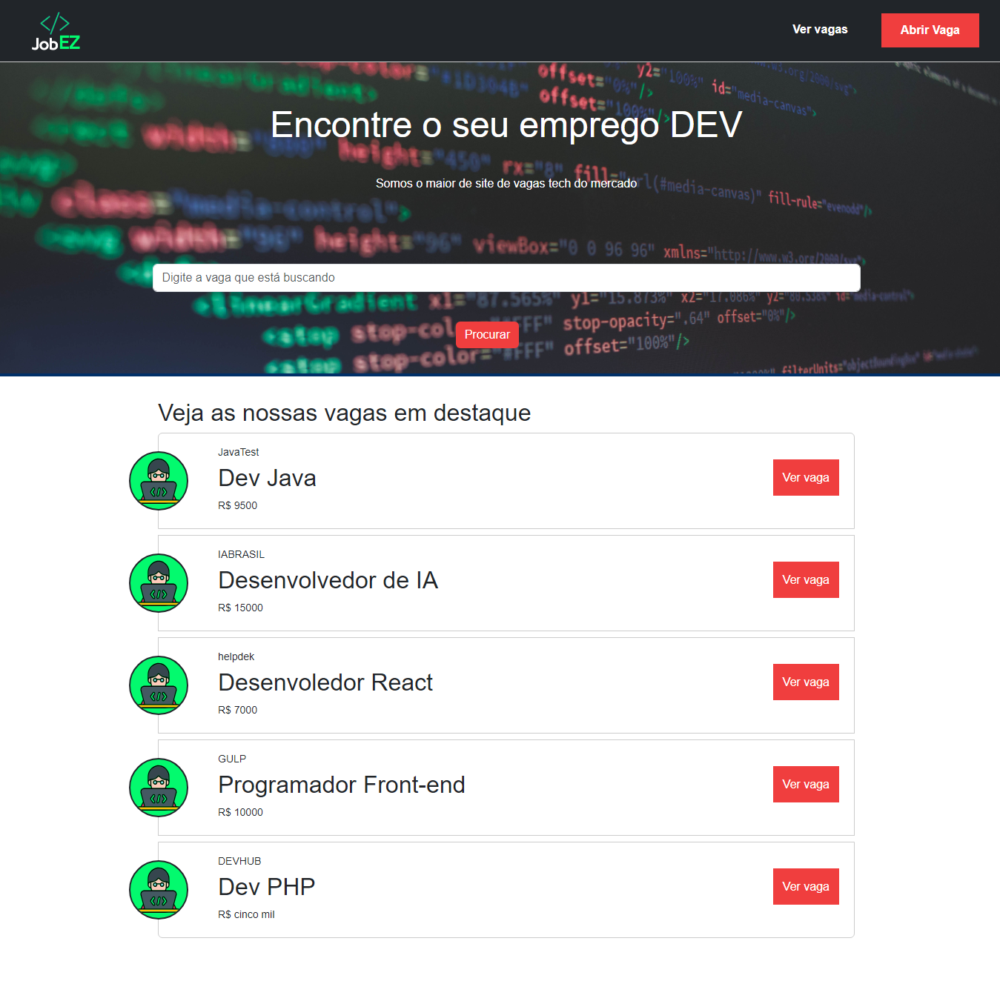
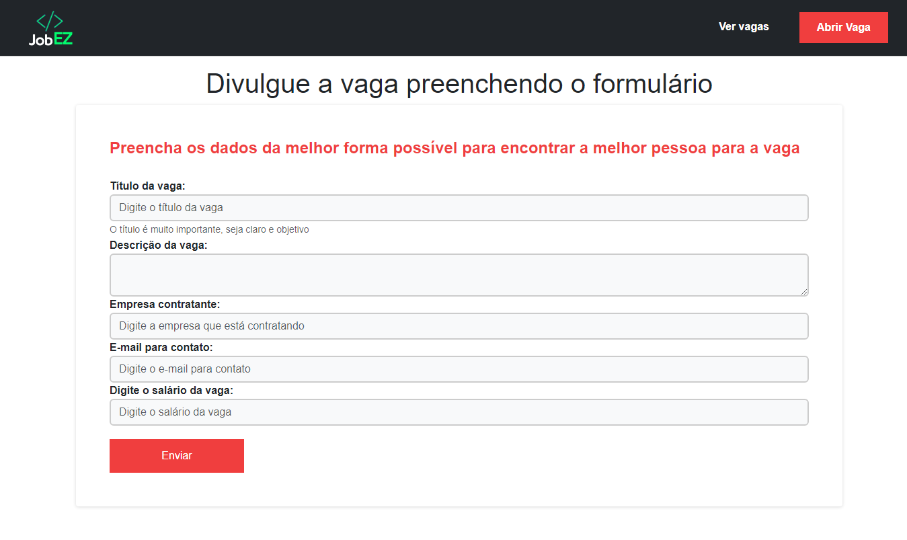
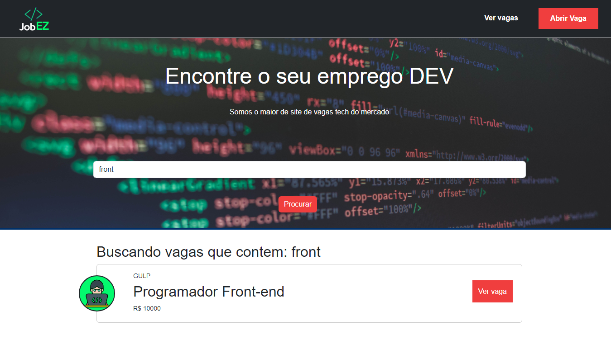

# JobEZ - plataforma de empregos dev
<p align="center">
  
  
</p>


<p align="center">
 <a href="#-sobre">Sobre</a> •
 <a href="#-projeto">Projeto</a> •
 <a href="#%EF%B8%8F-autor">Autor</a>
</p>

## 💻 Sobre

JobEZ é uma página de uma plataforma de empregos voltada para desenvolvedores. Nela, você pode facilmente cadastrar novas vagas, que são armazenadas em um banco de dados interno do projeto e inseridas na página através de templates em Handlebars. Além disso, com uma funcionalidade de pesquisa no campo de procura, permitindo que você encontre rapidamente as vagas desejadas. E para uma visualização mais detalhada, pode abrir cada vaga individualmente.

- [x] Página inicial busca vagas cadastradas no banco de dados
- [x] Página de Cadastro insere a nova vaga no Banco de dados interno do projeto
- [x] Pesquisa de vagas na página inicial que busca direto no banco de dados e retorna os resultados a página
- [x] Projeto tem as rotas em express utiliza o express-handlebars para as views
- [x] Sequelize para utilizar o sqlite

<h3 align="center">
⚙️ Tecnologias utilizadas

<p>&nbsp;</p>


  

  

</h3>

---

## 🚧 Projeto

<h3 align="center">Página princiapl
  <p></p>
  	
</h3>

<h3 align="center">Acessando vaga
  <p></p>
  	
</h3>

<h3 align="center">Cadastrando vaga
  <p></p>
  	
</h3>

<h3 align="center">Pesquisando vaga
  <p></p>
  	
</h3>

---

## Getting Started

1. Clone the repository to your local machine

```bash
    git clone git@github.com:cherPrado/JobEZ-plataforma-de-empregos-dev.git
```

2. Install the dependencies

```bash
    npm install
```

3. Start the application

```bash 
    npm run dev
```

4. Open in browser
```bash 
    http://localhost:3000/
```
---

## ✒️ Autor

| [ <br> <sub> Cherlau Prado </sub>](https://github.com/cherPrado) |
| :--------------------------------------------------------------------------------------------------------------------------------------------: |

<h2 >Entre em contato 🤙🏽</h2>

<div align="center">
<a href="https://www.linkedin.com/in/cherlau-prado/" target="_blank"></a>
<a href="cherlaufilho@discente.ufg.br" target="_blank"></a>
</div>
